## Demo Terraform-Git-Jenkins-Ansible Pipeline
*khoamd*  

===  

### 1. Lab workflows:
  

<!--    -->

===  

### 2. Prepare local environment:
#### *(I'm running this project on Windows 10 / 64-bit os)*
- Install Terraform library by downloading package from this link below:  
https://developer.hashicorp.com/terraform/downloads

- Install Git from this link below and perform configuration for git in local:  
https://git-scm.com/book/en/v2/Getting-Started-Installing-Git

- Install AWS CLI from this link below and perform configuration for remote SSH in local (using `"Remote - SSH"` vscode extension):  
https://docs.aws.amazon.com/cli/latest/userguide/getting-started-install.html

- Create a folder with this directoy as below:  
**`~/.lab/`**  
Then download all source code from this github repository to the `".lab/"` folder:
```ps
git clone 'https://github.com/mnikhoa/demo-1st-pipeline.git'
```

- Already have AWS acount (with access_key and secret_key) also Docker-hub and GitHub account (with their own access token key)

- Make sure that dependencies are created and located in their own place like this:  

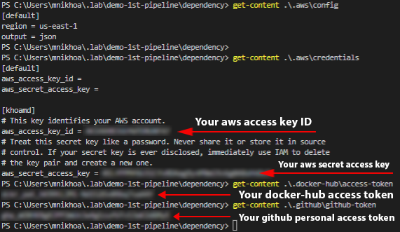  

> ***NOTE:***  
*- All `<.dependency_folder/dependency_file>` are placed in the directory `"~/"`, not `"~/.lab/demo-1st-pipeline/dependency"`*   

- Open Poweshell in Administrator privilege => run this command below:
```ps
set-executionpolicy remotesigned
```
or
```ps
Set-ExecutionPolicy Bypass
Set-ExecutionPolicy unrestricted
```
or
```ps
powershell "Set-ExecutionPolicy -Scope Process -ExecutionPolicy RemoteSigned -Force"
powershell "Set-ExecutionPolicy -Scope CurrentUser -ExecutionPolicy RemoteSigned -Force"
powershell "Set-ExecutionPolicy -Scope LocalMachine -ExecutionPolicy RemoteSigned -Force"
```  

===  

### 3. Run pipeline in the 1st time:
#### *This will need you open Powershell*
- Change directory >> **`"set-location"`** to folder containing this **`./cicd.ps1`** file

- Run command on Powershell with Administrator privilege:
```ps
./cicd.ps1

apply git-apply confirm git-master confirm git-push confirm git-dev confirm git-push confirm git-prod confirm git-push
```

- Check the output in Jenkins pipeline and Grafana dashboard.

> ***NOTE:***  

> *- Each action in the sequence will have to be seperated by `"space"`, or it will be appearing a warning*  
> *- Right after the action `"git-push"` is performed, you're gonna be switching to `"master branch"` automatically. So what ever changes you have pushed to other branches, push it to `"master branch"` too.*  
> *- Right after the first `"confirm"` action, let's do the necessary configuration for all services such as Jenkins (installing plugins, creating credentials, system configuration, creating multi-branch job, etc.) and Prometheus, Grafana... The `"./cicd.ps1"` will stop temporarily for you to do this.*  
> *- When the Powershell script is stopping with action `"confirm"`, type `"y"` (or `"yes"`) if you want to continue the actions sequence. On the contrary, type `"n"` (or `"no"`) to stop right away and exit. (Just in case you detect a fault while your actions sequence is running)*  
> *- You can config Jenkins server with these following information:*  
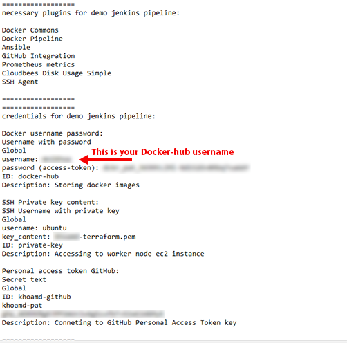  
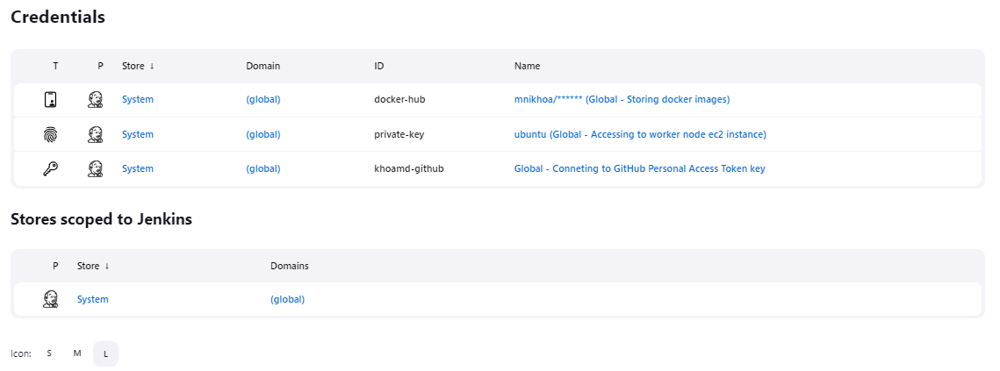  
> *- In `"Dashboard > Manage Jenkins > System"`:*  
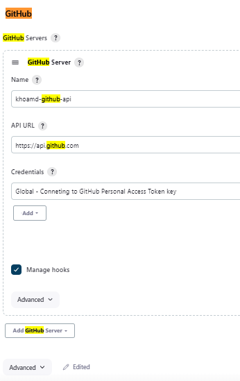  
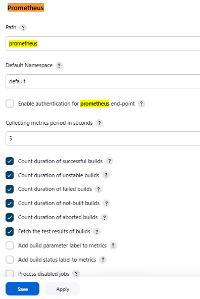  
> *- In `"Dashboard > Nodes > Built-In Node > Configure"`:*  
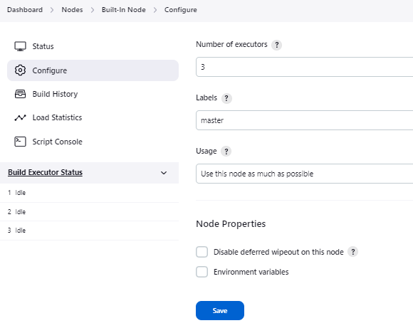  
> *- In `"Dashboard > All" (/view/all/newJob)`:*  
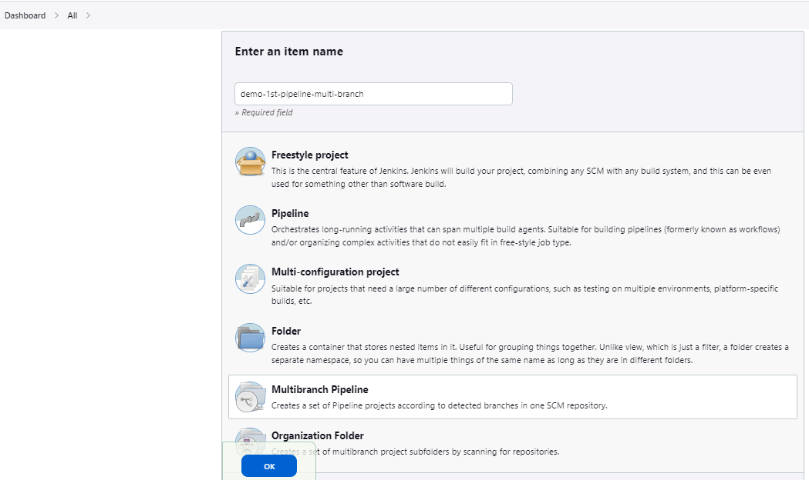  
> *- In `"Dashboard > demo-1st-pipeline-multi-branch > Configuration"`:*  
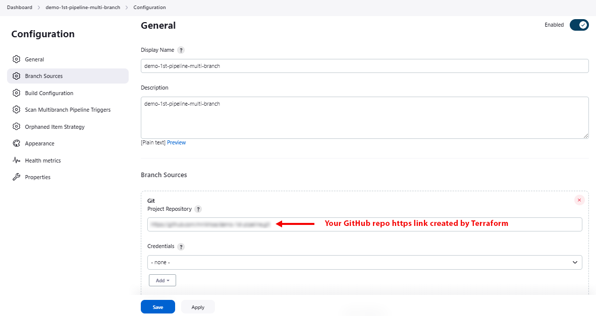  
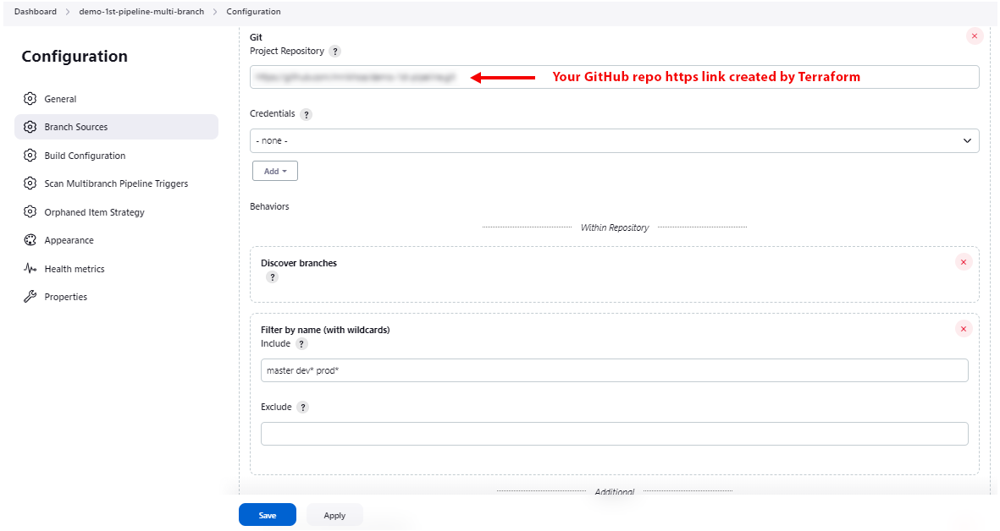  
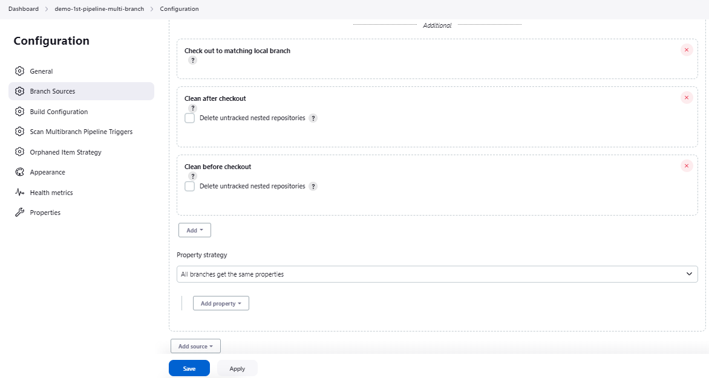  
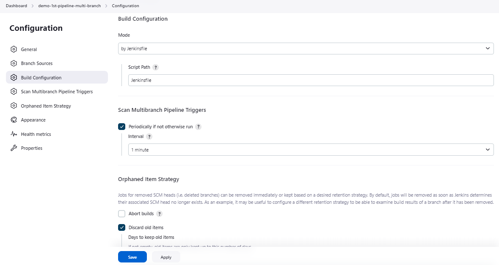  
> *- You can config Grafana service with these following information:*  
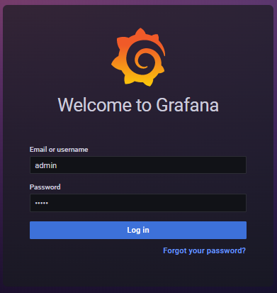  
> *- In `"/datasources"`:*  
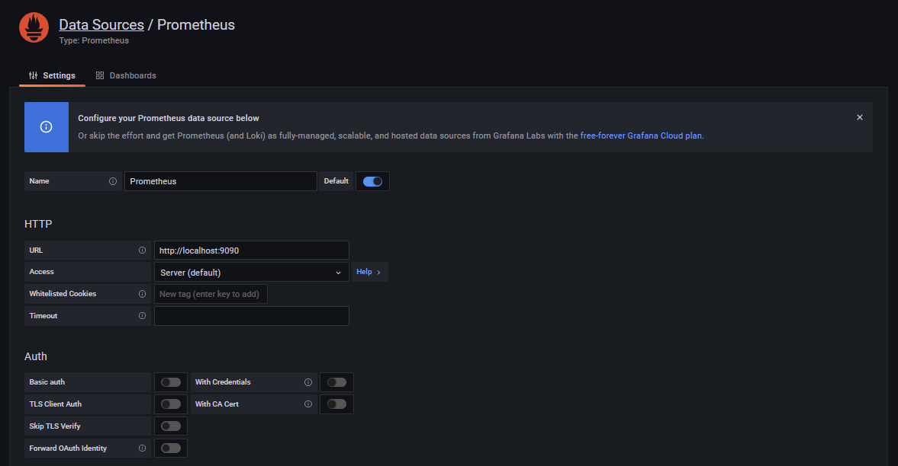  
> *- In `"/dashboard/import"`:*  
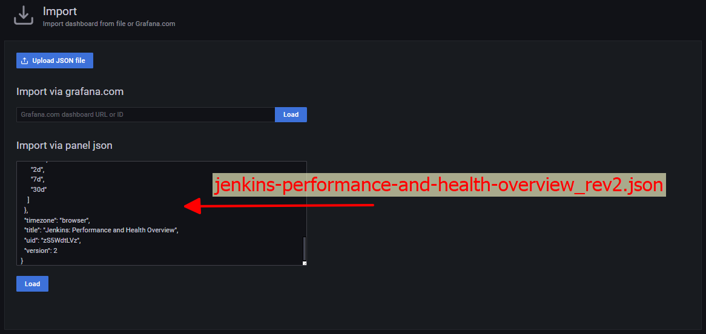  

===  

### 4. Run pipeline to refresh resources status after restarting or rebooting AWS Servers (then update code, etc):
#### *This will need you open Powershell*
- Assure that all servers are in **`"runing"`** status

- Change directory >> **`"set-location"`** to folder containing this **`./cicd.ps1`** file

- Run command on Powershell with Administrator privilege:
```ps
./cicd.ps1

refresh git-refresh confirm git-master confirm git-push confirm git-dev confirm git-push confirm git-prod confirm git-push
```

- Check the output in Jenkins pipeline and Grafana dashboard.

> ***NOTE:***  

> **DO NOT RUN `apply` ACTION OF THE `cicd.ps1` FILE WHILE SERVERS ARE IN `Stopped` STATE**  
> **IT'LL LEAD TO SERVERS TERMINATED ACTION**  
> **AND YOU'LL REGRET FOR THAT** 

===  

### 5. Run pipeline to refresh resources status without restarting or rebooting AWS Servers and update code, etc:
#### *This will need you open Powershell*
- Change directory >> **`"set-location"`** to folder containing this **`./cicd.ps1`** file

- Run command on Powershell with Administrator privilege:
```ps
./cicd.ps1

refresh git-refresh confirm git-master confirm git-push confirm git-dev confirm git-push confirm git-prod confirm git-push
```

- Check the output in Jenkins pipeline and Grafana dashboard.

===  

### 6. To destroy all Terraform and GitHub resources:
#### *This will need you open Powershell*
- Change directory >> **`"set-location"`** to folder containing this **`./cicd.ps1`** file

- Run command on Powershell with Administrator privilege:
```ps
./cicd.ps1

destroy git-destroy
```

- Check resource existing.

===  

### 7. You can also mix these actions `"apply"`, `"refresh"`, `"destroy"`, `"git-apply"`, `"git-refresh"`, `"git-destroy"`, `"git-push"`, `"git-master"`, `"git-dev"`, `"git-prod"`, `"confirm"` of the `./cicd.ps1` file:
#### *This will need you open Powershell*
- Change directory >> **`"set-location"`** to folder containing this **`./cicd.ps1`** file

- Run command on Powershell with Administrator privilege:
```ps
./cicd.ps1
```

- Type `"apply destroy"`, `"destroy git-destroy apply git-apply confirm git-prod git-push"`, `"refresh confirm destroy"`, `"apply git-dev confirm git-push destroy"`... or whatever you think to Powershell => Press ***Enter***, then check the output of this actions sequences.  

> * *You may custom the `cicd.ps1` as it's open Powershell source code file to find out your own pipeline.*  
> * *Or you can write the `config.py` to run configurations on web browser automatically.*  
> * *May you feel exciter to write another `linux-triggers.tpl` file to execute some Linux commands if you want to challenge running Terraform with Jenkins, etc.*  
