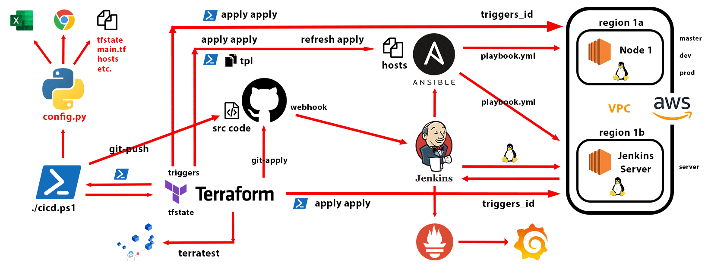

# Demo Terraform-Git-Jenkins-Ansible Pipeline
*khoamd*  

===  

## 1. Lab workflows:
  

<!--    -->

===  

## 2. Prepare local environment:
### *(I'm running this project on Windows 10 / 64-bit os)*
- Install terraform library by downloading package from this link below:  
https://developer.hashicorp.com/terraform/downloads

- Install git from this link below and perform configuration for git in local:  
https://git-scm.com/book/en/v2/Getting-Started-Installing-Git

- Make sure that dependencies are in their own place like this:  
(update later...)

- Already have AWS acount with access_key and secret_key

- Open Poweshell in Administrator privilege => run this command below:
```ps
set-executionpolicy remotesigned
```
or
```ps
Set-ExecutionPolicy Bypass
Set-ExecutionPolicy unrestricted
```
or
```ps
powershell "Set-ExecutionPolicy -Scope Process -ExecutionPolicy RemoteSigned -Force"
powershell "Set-ExecutionPolicy -Scope CurrentUser -ExecutionPolicy RemoteSigned -Force"
powershell "Set-ExecutionPolicy -Scope LocalMachine -ExecutionPolicy RemoteSigned -Force"
```  

===  

## 3. Run pipeline in the 1st time:
### *This will need you open Powershell*
- Change directory > **`"cd"`** to folder containing this **README.md** file

- Run command on Powershell with Administrator privilege:
```ps
./cicd.ps1

apply git-apply confirm git-master confirm git-push confirm git-dev confirm git-push confirm git-prod confirm git-push
```

<!-- - Type **`"apply apply"`** to Powershell => press ***Enter***  
  * *`apply` mode will creat all Terraform resoures on AWS cloud. It's similar to run `terraform init` & `terraform plan --out tfplan` & `terraform apply tfplan` at once.*  
  * *Typing `apply` twice because we want to run triggers timestamp in null-resource that would be connected to Jenkins server. This can be done to configure changing usermode of Jenkins as privilege one each time we run Docker command with it.* -->

> ***NOTE:***   
(update later...)

===  

## 4. Run pipeline to refresh resources status after restarting or rebooting AWS Servers (then update code, etc):
### *This will need you open Powershell*
- Assure that all servers are in **`"runing"`** status

- Run command on Powershell with Administrator privilege:
```ps
./cicd.ps1

refresh git-refresh confirm git-master confirm git-push confirm git-dev confirm git-push confirm git-prod confirm git-push
```

<!-- - Type **`"refresh apply gitpush"`** to Powershell => press ***Enter***  
*`refresh` mode will run as command `terraform plan -refresh-only`*   -->

> ***NOTE:***  

> **DO NOT RUN `apply` MODE OF THE `cicd.ps1` FILE WHILE SERVERS ARE IN `Stopped` STATE**  
> **IT'LL LEAD TO SERVERS TERMINATED ACTION**  
> **AND YOU'LL REGRET FOR THAT** 

===  

## 5. Run pipeline to refresh resources status without restarting or rebooting AWS Servers and update code, etc:
### *This will need you open Powershell*
- Run command on Powershell with Administrator privilege:
```ps
./cicd.ps1

refresh git-refresh confirm git-master confirm git-push confirm git-dev confirm git-push confirm git-prod confirm git-push
```

<!-- - Type **`"refresh apply gitpush"`** to Powershell => press ***Enter***  
*(You may need to update `version` file to new version first)*   -->

===  

## 6. To destroy all Terraform resources:
### *This will need you open Powershell*
- Change directory > **`"cd"`** to folder containing this **README.md** file

- Run command on Powershell with Administrator privilege:
```ps
./cicd.ps1

destroy git-destroy
```

<!-- - Type **`"destroy"`** to Powershell => press ***Enter***  
*`destroy` mode will destroy every terraform resources you have built to AWS.*   -->

===  

## 7. You can also mix these actions `apply`, `refresh`, `destroy`, `git-apply`, `git-refresh`, `git-destroy`, `git-push`, `git-master`, `git-dev`, `git-prod`, `confirm` of the `cicd.ps1` file:
### *This will need you open Powershell*
- Change directory > **`"cd"`** to folder containing this **README.md** file

- Run command on Powershell with Administrator privilege:
```ps
./cicd.ps1
```

- Type `"apply destroy"`, `"destroy apply apply"`, `"refresh destroy"`, `"apply git-push destroy"`... or whatever you think to Powershell => Press ***Enter***, then check the output.  

> * *You may custom the `cicd.ps1` as it's open Powershell source code file to find out your own pipeline.*  
> * *Or you can write the `config.py` to run configurations on web browser automatically.*  
> * *May you feel exciter to write another `linux-triggers.tpl` file to execute some Linux commands if you want to challenge running Terraform with Jenkins, etc.*  
