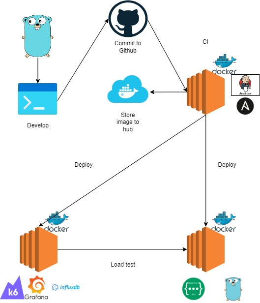

# Readme Mock

<!--  -->

Dev code golang đẩy lên github, Jenkins nghe chạy pipeline build image đẩy lên Docker hub, Ansible deploy image từ hub lên instance EC2 dưới dạng Docker container, code K6 tích hợp với InfluxDB và Grafana được orchestra bới Docker-compose .
