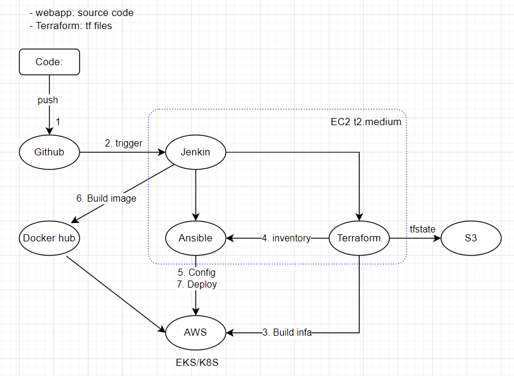

# DEVOPS Mockup project
## 1. Diagaram

## Flow
1. push code lên git hub
2. Jenkin sẽ trigger
3. nếu chưa có infa -> build infa
    - Tfstate được lưu trữ vào s3
4. Tạo file inventory từ tfstate để Ansible sử dụng
5. dùng Ansible để cấu hình infa
6. Build docker image lên docker hub
7. Deploy trên K8S/EKS

## TODO
[] test backend terraform bằng s3

